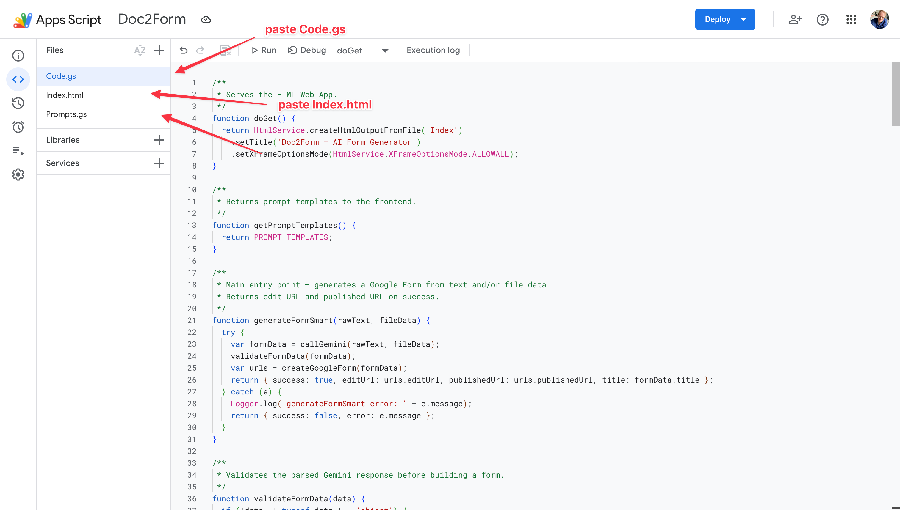

# 📄 Doc2Form — Turn any PDF, Word, or text into a Google Form

[](LICENSE)
[](https://script.google.com)
[](https://ai.google.dev/)
[](https://github.com/kamilstanuch/doc2form/pulls)

> Tired of receiving PDFs and Word docs that should've been a Google Form? Same.

**Doc2Form** is a free, open-source Google Apps Script that uses Gemini AI to convert any document (PDF, Word) into a fully functional Google Form — or just describe the form you want, and it builds it for you.

No servers. No hosting. No costs beyond the free Gemini API. Runs entirely inside your Google account. A hosted version with no setup required is available at [doc2form.dev](https://doc2form.dev).

<!-- Demo GIFs (720px): doc2form-demo720_pdf.gif = Upload tab; doc2form-demo720_prompt.gif = Describe a form tab -->

<p align="center">
  <strong>Upload a document</strong> — PDF or Word → Google Form<br>
  
</p>

<p align="center">
  <strong>Describe a form</strong> — type what you need in the <em>Describe a form</em> tab → Google Form<br>
  
</p>

---

## How It Works

```
┌─────────────────────────────────────────────────────────────────┐
│                          YOU                                    │
│                                                                 │
│   ┌──────────────┐     OR     ┌──────────────────────────┐      │
│   │  📄 Upload   │           │  ✏️  Describe a form      │      │
│   │  PDF / Word  │           │  "Create a feedback       │      │
│   │              │           │   survey with scales..."   │      │
│   └──────┬───────┘           └────────────┬──────────────┘      │
└──────────┼────────────────────────────────┼─────────────────────┘
           │                                │
           ▼                                ▼
┌─────────────────────────────────────────────────────────────────┐
│                   Google Apps Script                             │
│                                                                 │
│   .docx → Mammoth.js extracts text                              │
│   .pdf  → sent as base64 binary                                 │
│                                                                 │
│          ┌────────────────────────────┐                          │
│          │  🤖 Gemini AI              │                          │
│          │  Analyzes content →        │                          │
│          │  Returns structured JSON   │                          │
│          │  with questions, types,    │                          │
│          │  options, and settings     │                          │
│          └────────────┬───────────────┘                          │
│                       │                                         │
│                       ▼                                         │
│          ┌────────────────────────────┐                          │
│          │  📋 Google Forms API       │                          │
│          │  Builds the form with      │                          │
│          │  11 question types,        │                          │
│          │  sections, and validation  │                          │
│          └────────────┬───────────────┘                          │
└───────────────────────┼─────────────────────────────────────────┘
                        │
                        ▼
          ┌──────────────────────────────┐
          │  ✅ Your Google Form         │
          │                              │
          │  📝 Edit link (for you)      │
          │  🔗 Share link (for others)  │
          │  📋 One-click copy           │
          └──────────────────────────────┘
```

---

## Features

| | Feature | |
|---|---|---|
| 📄 | **Upload PDF or Word** | AI reads it, extracts fields, builds a form |
| ✏️ | **Describe in plain English** | "Create a 10-question feedback survey" → done |
| 🎯 | **8 ready-made templates** | Feedback, RSVP, job application, quiz, and more |
| 📊 | **11 question types** | Short answer, scales, grids, dates, dropdowns... |
| 🔗 | **Both links returned** | Edit link + share link with one-click copy |
| 🆓 | **100% free** | No server, no hosting, no costs |

## Setup (5 minutes)

> **Prefer to skip this?** [doc2form.dev](https://doc2form.dev) is a hosted version — no API keys, no deployment, no configuration needed.

### 1. Get a Gemini API Key

1. Go to [Google AI Studio](https://aistudio.google.com/apikey)
2. Click **Create API Key**
3. Copy the key — you'll need it in step 3

### 2. Create the Apps Script Project

1. Go to [Google Apps Script](https://script.google.com) and click **New Project**
2. Delete the default `Code.gs` content
3. Copy the contents of each file into your project:

| This repo | Apps Script file | How to create |
|-----------|-----------------|---------------|
| `code.gs` | `Code.gs` | Replace the default file |
| `Prompts.gs` | `Prompts.gs` | File → New → Script |
| `Index.html` | `Index.html` | File → New → HTML |
| `appsscript.json` | `appsscript.json` | See note below |

> **To edit `appsscript.json`:** Click the gear icon (⚙️ Project Settings) → check **"Show 'appsscript.json' manifest file in editor"** → go back to Editor and edit the file.

<p align="center">
  
</p>

### 3. Add Your API Key

1. In Apps Script, click ⚙️ **Project Settings**
2. Scroll to **Script Properties**
3. Click **Add Script Property**
4. Set:
   - Property: `GEMINI_API_KEY`
   - Value: *(paste your key)*
5. Save

### 4. Deploy as Web App

1. Click **Deploy** → **New deployment**
2. Click the gear icon → select **Web app**
3. Set:
   - Description: `Doc2Form`
   - Execute as: **Me**
   - Who has access: **Anyone** (or restrict as needed)
4. Click **Deploy**
5. Authorize the app when prompted
6. Copy the web app URL — that's your Doc2Form!

## Alternative: Use `clasp` (for developers)

If you prefer working locally with version control:

```bash
npm install -g @google/clasp
clasp login
clasp create --type webapp --title "Doc2Form"
clasp push
clasp deploy
```

See `.clasp.json.example` for the config format.

## Project Structure

```
├── code.gs            # Main backend — Gemini API calls, form builder, validation
├── Prompts.gs         # Predefined prompt templates (easy to customize)
├── Index.html         # Frontend UI — tabs, file upload, templates, results
├── appsscript.json    # Apps Script manifest (scopes, runtime config)
├── screenshots/       # README images & demo GIFs (PDF upload + prompt flows)
└── README.md
```

## Customization

### Add Your Own Templates

Open `Prompts.gs` and add entries to the `PROMPT_TEMPLATES` array:

```javascript
{
  id: 'mytemplate',
  name: 'My Custom Template',
  icon: 'star',                        // Any Material Icons Outlined name
  description: 'What this template does',
  prompt: 'The full prompt text that describes the form to generate...'
}
```

Icons: browse [Material Icons](https://fonts.google.com/icons?icon.set=Material+Icons) for icon names.

### Change the AI Model

In `code.gs`, change the `model` variable:

```javascript
var model = 'gemini-2.5-flash';   // Fast & capable (default)
var model = 'gemini-2.5-pro';     // More powerful, slower
```

### Supported Question Types

| Type | Google Forms equivalent |
|------|----------------------|
| `SHORT_ANSWER` | Short text field |
| `PARAGRAPH` | Long text field |
| `MULTIPLE_CHOICE` | Radio buttons |
| `CHECKBOX` | Checkboxes |
| `DROPDOWN` | Dropdown menu |
| `LINEAR_SCALE` | 1-5 or 1-10 scale |
| `DATE` | Date picker |
| `TIME` | Time picker |
| `MULTIPLE_CHOICE_GRID` | Grid with radio buttons |
| `CHECKBOX_GRID` | Grid with checkboxes |
| `SECTION_HEADER` | Page/section break |

## Limitations

- **File size:** 5 MB max (Apps Script constraint)
- **PDF quality:** Gemini handles most PDFs well, but heavily scanned/image-based PDFs may produce less accurate results
- **Rate limits:** The free Gemini API has usage limits — if you hit them, wait a minute and try again
- **Google Apps Script quotas:** [Standard quotas apply](https://developers.google.com/apps-script/guides/services/quotas)

## Contributing

PRs welcome! Some ideas:

- [ ] Image-based question support
- [ ] Form preview before creation
- [ ] Batch processing (multiple files → multiple forms)
- [ ] Export form structure as JSON
- [ ] Dark mode

## Built With

| | Technology | Role |
|---|---|---|
|  | Google Apps Script | Runtime & hosting |
|  | Gemini 2.5 Flash | Document analysis & form structuring |
|  | Google Forms API | Form creation |
|  | Mammoth.js | Word (.docx) text extraction |

## License

MIT — do whatever you want with it. See [LICENSE](LICENSE).

---

If this saved you from another PDF form, consider giving it a star.
